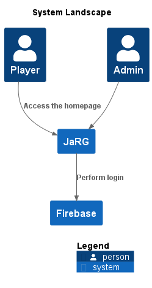

# Landscape

[png](./images/landscape.png) | [svg](./images/landscape.svg)

## Software Systems

 - [Firebase](software-systems/Firebase/README.md)
 - [JaRG](software-systems/JaRG/README.md)

## Stats

### Software Systems

| Software System | # Containers | # Components |
| --- | --- | --- |
| Firebase | 2 | 6 |
| JaRG | 6 | 25 |

### Containers

| Software System | Container | # Components |
| --- | --- | --- |
| Firebase | Firebase Auth WebApp | 3 |
| Firebase | Firebase Auth js | 3 |
| JaRG | Database | 4 |
| JaRG | JaRG Container Webapp | 5 |
| JaRG | JaRG Editor Backend | 5 |
| JaRG | JaRG Editor WebApp | 5 |
| JaRG | JaRG Game Backend | 4 |
| JaRG | JaRG Game WebApp | 2 |

## Relations

| Software System | # |
| --- | --- |
| Firebase | 0 |
| JaRG | 7 |

| Software System | Container | # |
| --- | --- | --- |
| Firebase | Firebase Auth WebApp | 0 |
| Firebase | Firebase Auth js | 4 |
| JaRG | Database | 0 |
| JaRG | JaRG Container Webapp | 6 |
| JaRG | JaRG Editor Backend | 8 |
| JaRG | JaRG Editor WebApp | 7 |
| JaRG | JaRG Game Backend | 8 |
| JaRG | JaRG Game WebApp | 5 |

| Software System | Container | Component | # |
| --- | --- | --- | --- |
| Firebase | Firebase Auth WebApp | Login/Registration features | 0 |
| Firebase | Firebase Auth WebApp | User Identity | 0 |
| Firebase | Firebase Auth WebApp | User SSO token | 0 |
| Firebase | Firebase Auth js | Login/Registration features | 2 |
| Firebase | Firebase Auth js | User Identity | 2 |
| Firebase | Firebase Auth js | User SSO token | 2 |
| JaRG | Database | Characters | 0 |
| JaRG | Database | Maps | 0 |
| JaRG | Database | Missions | 0 |
| JaRG | Database | Users | 0 |
| JaRG | JaRG Container Webapp | Login | 3 |
| JaRG | JaRG Container Webapp | Logout | 3 |
| JaRG | JaRG Container Webapp | Public page | 3 |
| JaRG | JaRG Container Webapp | Registration | 3 |
| JaRG | JaRG Container Webapp | Start Game | 5 |
| JaRG | JaRG Editor Backend | Edit Characters services | 3 |
| JaRG | JaRG Editor Backend | Edit Map services | 3 |
| JaRG | JaRG Editor Backend | Edit Missions services | 3 |
| JaRG | JaRG Editor Backend | Manages user accesses and grants | 3 |
| JaRG | JaRG Editor Backend | Verify SSO token | 5 |
| JaRG | JaRG Editor WebApp | Identify the user | 3 |
| JaRG | JaRG Editor WebApp | Manages user accesses and grants | 3 |
| JaRG | JaRG Editor WebApp | Update characters | 3 |
| JaRG | JaRG Editor WebApp | Update maps | 3 |
| JaRG | JaRG Editor WebApp | Update missions | 3 |
| JaRG | JaRG Game Backend | Characters services | 3 |
| JaRG | JaRG Game Backend | Map services | 3 |
| JaRG | JaRG Game Backend | Missions services | 3 |
| JaRG | JaRG Game Backend | Verify SSO token | 5 |
| JaRG | JaRG Game WebApp | Identify the user | 3 |
| JaRG | JaRG Game WebApp | Mission selection | 3 |

