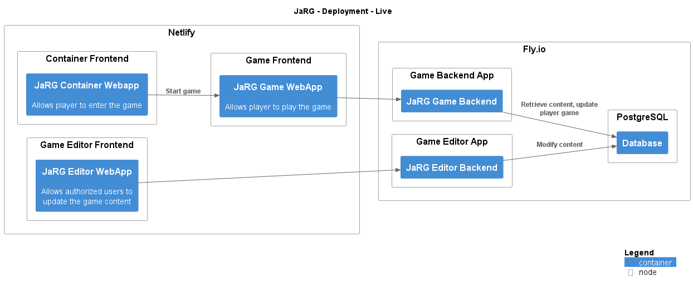

# JaRG

## System Contexts

### JaRG - System Context

Description: System Context of JaRG

[png](../../images/system_context%20JaRG.png) | [svg](../../images/system_context%20JaRG.svg)

## Containers

| Container | Description |
| --- | --- |
| Database |  |
| JaRG Container Webapp | Allows player to enter the game |
| JaRG Editor Backend |  |
| JaRG Editor WebApp | Allows authorized users to update the game content |
| JaRG Game Backend |  |
| JaRG Game WebApp | Allows player to play the game |

### JaRG - Containers

Description: Container view of JaRG

[png](../../images/container%20JaRG.png) | [svg](../../images/container%20JaRG.svg)

## Relationships

### Used By

| Element | Description | Tags |
| --- | --- | --- |
| Admin |  | Element,Person |
| Player |  | Element,Person |

### Uses

| Element | Description | Tags |
| --- | --- | --- |
| [Firebase Auth WebApp](../../../software-systems/Firebase/Firebase%20Auth%20WebApp/README.md) | Manages user authentication | Element,Container |
| [User SSO token](../../../software-systems/Firebase/Firebase%20Auth%20WebApp/README.md) |  | Element,Component |
| [Firebase Auth js](../../../software-systems/Firebase/Firebase%20Auth%20js/README.md) | Proxy to user authentication | Element,Container |
| [Login/Registration features](../../../software-systems/Firebase/Firebase%20Auth%20js/README.md) |  | Element,Component |
| [User Identity](../../../software-systems/Firebase/Firebase%20Auth%20js/README.md) |  | Element,Component |
| [User SSO token](../../../software-systems/Firebase/Firebase%20Auth%20js/README.md) |  | Element,Component |
| [Firebase](../../../software-systems/Firebase/README.md) |  | Element,Software System |

## Deployments

### JaRG - Deployment - Live

[png](../../images/deployment_jarg_live.png) | [svg](../../images/deployment_jarg_live.svg)

